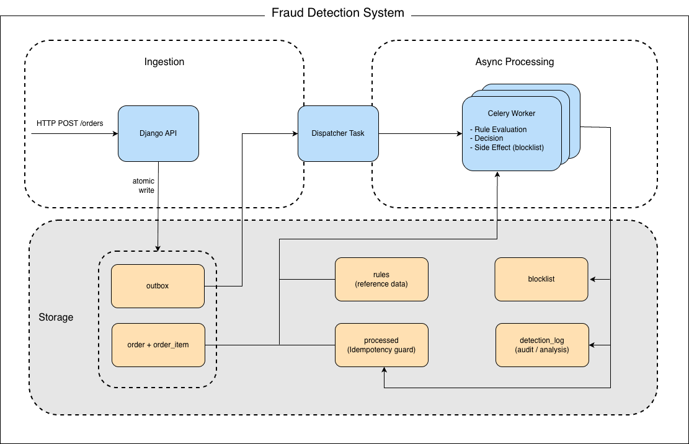

# FDS v2 — Fraud Detection System Prototype

---

## 1. Why This Project Exists

FDS v2 is a fraud detection system prototype that reconstructs detection workflows I previously operated in production.

The system decisions were shaped by legacy constraints and incremental fixes
that made the system harder to understand and reason about.

This project revisits fraud detection from a system design perspective,
focusing on making decisions explicit and system behavior analyzable.

---

## 2. Problems Observed in Production

### 2.1 Short-circuit Detections and Limited Visibility

Rules were evaluated sequentially and stopped at the first match.

This was efficient for real-time decisions,
but only triggered rules were recorded while other signals were lost.

As a result, it was difficult to understand detection behavior
or analyze how rules contributed over time.

### 2.2 Explainable Decisions, Invisible Evaluation

Decisions were explainable through rule IDs and transaction data.

However, the system did not capture non-triggered evaluations or near-miss cases.

As a result, it was difficult to understand how rules behaved unless they fired.

### 2.3 Rule Changes Were Hard to Verify

Rule changes needed to be tested under production-like conditions.

However, there was no reliable way to replay historical events
or validate changes safely.

This made iteration slower and increased the risk of unintended side effects.

---

## 3. Key Design Decisions

This project focuses on three design decisions to improve observability and verification.

### 3.1 Asynchronous Detection

To address the tight coupling between request latency and rule evaluation cost,
detection is decoupled from the request lifecycle and processed asynchronously.

This keeps ingestion predictable and introduces a clear retry boundary.

As a result, detection can scale independently without affecting request latency.

### 3.2 Separation of Detection and Decision

To address the lack of visibility caused by short-circuit evaluation,
rule evaluation is separated from enforcement.

All evaluation results are recorded, including non-blocking and near-miss cases.

### 3.3 Production-Equivalent Evaluation and Replay

To address the lack of consistency between live detection and offline validation,
the same rule engine is used for both production execution and replay.

This enables safe validation of rule changes using real historical data,
reducing the risk of unintended side effects in production.

---

## 4. What This Design Changes

Compared with a request-coupled detection flow, this design changes three things:

- ingestion remains fast and durable even when rule evaluation becomes heavier,
- rule behavior becomes inspectable beyond only triggered outcomes,
- and rule changes can be validated by replaying historical events through the same engine.

As a result, the system is designed not only to make decisions,
but to make detection behavior observable and verifiable.

---

## 5. Architecture



The system is organized as a simple asynchronous pipeline:

**Ingestion → Dispatch → Detection**

- **Ingestion** stores the incoming snapshot and writes an outbox row in the same transaction.
- **Dispatch** moves READY outbox events to background workers.
- **Detection** evaluates rules, applies side effects, and records results.

This keeps request handling small and durable,
while moving heavier rule evaluation into an independent worker stage.

As a result, request latency stays predictable,
and detection behavior becomes easier to retry, inspect, and replay.

---

## 6. Domain Model

The system models fraud detection around explicit ingestion, processing, and enforcement boundaries.

| Entity        | Description                                                  |
|---------------|--------------------------------------------------------------|
| Order         | User-intent event with items, price, and metadata            |
| Purchase      | Payment attempt tied to an order                             |
| Outbox        | Durable event queue for asynchronous processing              |
| Processed     | Idempotency record to prevent duplicate execution            |
| Rule          | Detection condition evaluated against event context          |
| DetectionLog  | Stored evaluation result for replay, audit, and analysis     |
| Blocklist     | Enforcement state for restricted accounts, devices, or cards |

These boundaries make detection behavior explicit, enabling inspection, replay, and safe evolution of rules.

---

## 7. Example Scenario

Example: a purchase event is submitted for an account from a new device.

1. `POST /purchases` is received  
2. The purchase snapshot is stored  
3. An outbox event is created  
4. A worker processes the event asynchronously  
5. The rule engine evaluates multiple conditions  
6. Evaluation results and final decision are recorded  
7. Blocklist state may be updated if required  

This shows how ingestion, evaluation, and enforcement are separated,
while preserving rule-level traceability for later analysis or replay.

---

## 8. Future Extensions


- **Rule Simulation & Replay Engine**  
  Replays historical snapshots to check how rule changes behave before deployment.


- **Fine-Grained Audit Viewer**  
  Shows each detection step: inputs, triggered rules, intermediate states, and final decisions.


- **Chargeback & Dispute Analytics Dashboard**  
  Aggregates outcomes, rule triggers, false-positive rates, and dispute ratios.

---

## 9. Tech Stack

- Python 3.11  
- Django / DRF
- Celery  
- Redis  
- PostgreSQL  
- Docker  

---

## 10.	Running with Docker

This project includes a Docker Compose setup that allows you to run the API, Celery workers, Redis, and PostgreSQL together.

### 10.1 Start the stack

Run the following command from the project root:

```bash
docker compose up --build
```

This command will build all images and start:
- Django API containers
- Celery workers and Celery beat
- Redis
- PostgreSQL

Once the stack is running, the APIs are accessible from your host machine.

---

### 10.2 Synchronous detection API (debug / direct evaluation)

The synchronous endpoint executes fraud detection during the request/response cycle and immediately returns a decision.

```bash
curl -X POST http://127.0.0.1:8000/fds/detect/order \
  -H "Content-Type: application/json" \
  -H "Accept: application/json" \
  -d '{
    "order_id": "ORD123",
    "account_id": "A100",
    "device_id": "D100",
    "order_country": "JP",
    "total_price": 12000,
    "currency": "JPY",
    "order_status": "CREATED",
    "items": [
      {"product_id": "P1", "unit_price": 6000, "quantity": 2}
    ],
    "metadata": {"source": "mobile-web"}
  }'
```
Example response (will vary depending on rules you configure):

```js
{
  "decision": "allow",
  "reasons": [],
  "register_blocklist": false,
  "register_params": {
    "user": null,
    "device": null,
    "card": null
  }
}
```

---

### 10.3 Asynchronous ingestion API (production path)

The asynchronous path only ingests the snapshot and enqueues work.
Heavy rule evaluation is done later by Celery workers consuming Outbox events.

```bat
curl -X POST http://127.0.0.1:8000/orders \
  -H "Content-Type: application/json" \
  -H "Accept: application/json" \
  -d '{
    "order_id": "ORD123",
    "account_id": "A100",
    "device_id": "D100",
    "order_country": "JP",
    "total_price": 12000,
    "currency": "JPY",
    "order_status": "CREATED",
    "items": [
      {"product_id": "P1", "unit_price": 6000, "quantity": 2}
    ],
    "metadata": {"source": "mobile-web"}
  }'
```
Expected response:

```js
{"status": "queued"}
```
What happens internally:
1.	Django upserts the Order snapshot.
2.	An Outbox row is inserted with status READY.
3.	A Celery worker picks up the Outbox batch and calls the rule engine.
4.	Results are stored in the Processed table for idempotency and audit.


---